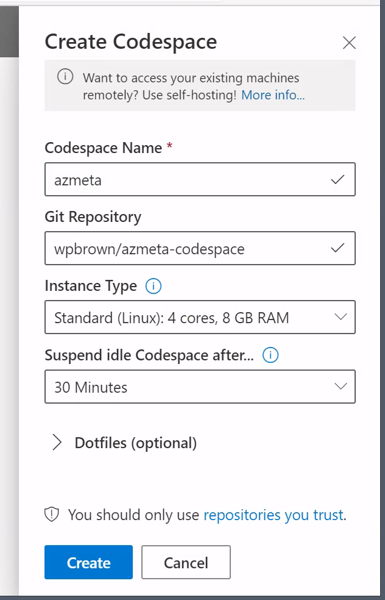
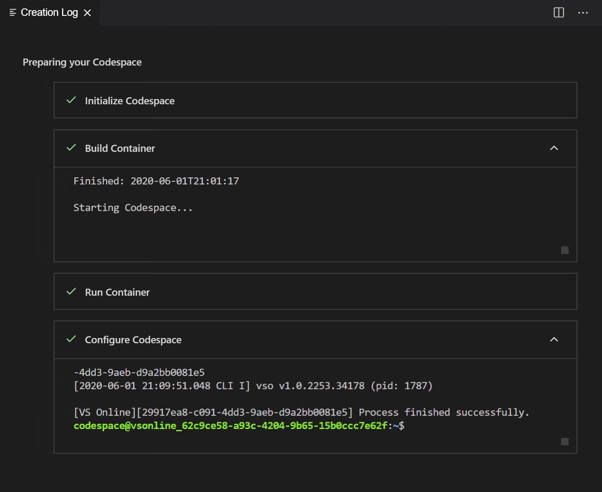
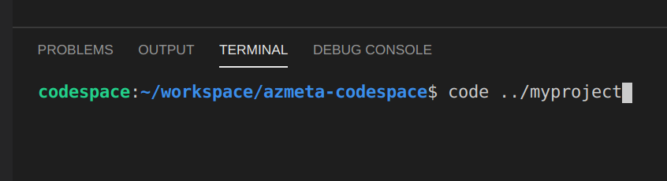
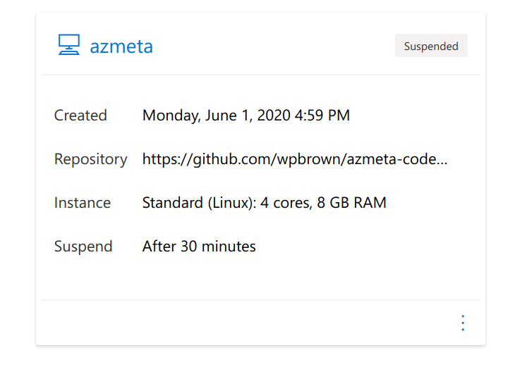
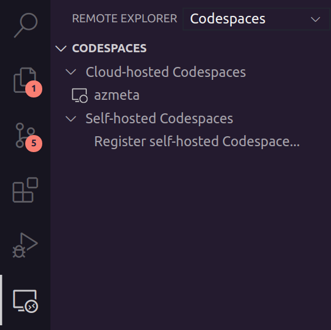

# azmeta-codespace

Setup a pre-configured [Codespace](https://visualstudio.microsoft.com/services/visual-studio-codespaces/) for Azure metadata analysis.

# Deploy

1. [Create](https://docs.microsoft.com/en-us/visualstudio/online/how-to/browser#create-a-plan) a Codespaces plan.

2. [Deploy](https://online.visualstudio.com/environments/new?name=azmeta&repo=wpbrown/azmeta-codespace) an instance of this Codespace.

   

   Git Repository: `wpbrown/azmeta-codespace` 

3. Wait for setup of your Codespace to complete.

   

4. Use `` Ctrl+` `` (graven accent) to open a terminal and run the command `code ../myproject` to open a preconfigured azmeta workspace. A new browser tab will open in the `myproject` workspace.

   

# Connect to your Codespace 

Your Codespace and all of your code runs in Azure regardless of how you interface with the it.

*Note: Connecting to Jupyter Lab via a browser-based Codespaces session is [not yet supported](https://github.com/wpbrown/azmeta-codespace/issues/1).*

## In a Browser

Go to `https://online.visualstudio.com/environments` and click your Codespace to resume it and connect in the browser.

To quickly jump in to the `myproject` workspace in your Codespace, bookmark `https://online.visualstudio.com/environment/{CODESPACE_ID}?folder=%2Fhome%2Fcodespace%2Fworkspace%2Fmyproject` where `{CODESPACE_ID}` is the GUID of your Codespace.

* [Codespaces Browser Quickstart Docs](https://docs.microsoft.com/en-us/visualstudio/online/quickstarts/browser)

## In Visual Studio Code

Install the [Codespaces extension](https://marketplace.visualstudio.com/items?itemName=MS-vsonline.vsonline) in Visual Studio Code. Click your Codespace in the extension to connect in Visual Studio Code.

* [Codespaces Browser Quickstart Docs](https://docs.microsoft.com/en-us/visualstudio/online/quickstarts/vscode)
